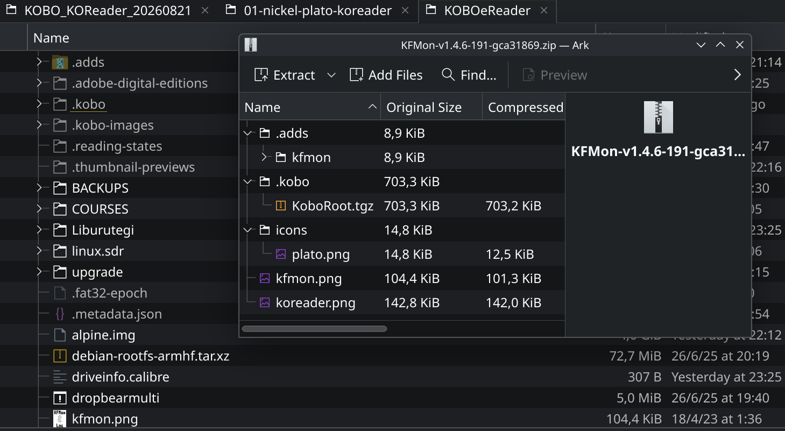

# Kobo's must, Part 1: `KFMon`, `NickelMenu`, `KOReader`


This directory contains the resources, configuration files, and instructions for installing and maintaining a complete third-party launcher setup on Kobo e-readers.  

> ⚠️ **Tested on a Kobo Clara Colour.** If you are using a different e-reader model, you must follow the steps applicable to that particular device (similar to these) and, very importantly, check that the versions of the components you are using are the specific ones required for your device.  


| Component | Description |
|-----------|-------------|
| **KFMon** | File-trigger based launcher that watches for specific files (such as icons) and launches applications when they are opened, but **it does not survive firmware updates** |
| **NickelMenu** | An in-app menu extension that adds custom entries to Kobo's stock interface (Nickel). **Survives firmware updates** better than other launchers |
| **KOReader** | The best open-source reader for e-ink devices. Supports PDF, EPUB, CBZ, and many other formats with extensive customisation options |
| **Plato** | A minimalist, high-performance document reader for Kobo devices, designed as an alternative to KOReader |

---

## Manual Installation Method

### Part 1:     repare eReader

- Assuming that your Kobo is already fully operational, requires no further activation, and is running the latest firmware (or that you do not intend to update it while carrying out this process):

1.  Connect it to your PC via USB and locate this file: `./.kobo/Kobo/Kobo eReader.conf`

2.  Look for the `[FeatureSettings]` tag and add the following line within its scope: `ExcludeSyncFolders=((?!kobo|adobe).+|([^.][^/]*/)+.+)`

    ```conf
    ReleaseNotesShown=true

    [FeatureSettings]
    AntiAliasing=true
    ExcludeSyncFolders=((?!kobo|adobe).+|([^.][^/]*/)+.+)
    HandwritingTimeout=300
    ShowLayoutRectangles=true

    [Instapaper]
    AccessToken=@ByteArray(asdasdasdasdasdasdasdasdasdasdasd)
    LastSync=1787397716
    ```
    
3.  Restart your device (shut it down completely and turn it back on).  
    This will prevent your e-reader from going mad trying to index hidden folders, and you will be grateful for it later.

    
### Part 2:     Prepare KFMon

> This step will also need to be performed if you update your e-reader's firmware in the future.

4.  Get the latest version available for your device.
    For a Kobo Clara Colour, as of August 2026, the optimal version of KFMon is:
    
    - **KFMon-v1.4.6-191**-gca31869.zip, [here](https://www.mobileread.com/forums/showthread.php?t=274231)
    
5.  Extract the contents into the root of your device:

    
    
    -   **Simply allow the internal files to be written into the Kobo's existing folders.**  
    -  ⚠️ **DO NOT** uncompress `KoboRoot.tgz` files before or after copying to the device.
    
6.  Restart the device. When you safely disconnect the USB cable, the Kobo itself will ask whether you want to install an update (the one you have just copied to its internal storage).  
    Let it update, and do not worry if you see "strange patterns" on the screen while it performs the various reboots.


### Part 3: Install NickelMenu

>   NickelMenu is an extension that adds custom entries to the Kobo software's menu (Nickel). 

>   NickelMenu survives to firmware updates

7.  Download the latest version of NickelMenu.   
    You can obtain the `KoboRoot.tgz` file from its [official repository](https://github.com/pgaskin/NickelMenu/releases)

8.  Copy the `KoboRoot.tgz` file **without extracting it** to the `/.kobo/` directory on your device.

9.  Safely eject the device and disconnect it. As you already know, the Kobo will restart and process the installation.  
    If everything has gone correctly, you will see a new entry called **"NickelMenu"** in the bottom-right corner of the home screen.
    
    

### Part 4: Prepare KOReader

>   You will not need to repeat this step when the Kobo firmware is updated, although you will need to do it whenever you want to manually update KOReader (which is recommended, as new updates are released monthly).

>   Its official repository also contains the [wiki](https://github.com/koreader/koreader/wiki/Installation-on-Kobo-devices), which explains how to operate KOReader.

10. Download the latest version of KOReader for Kobo from its [official repository](https://github.com/koreader/koreader/releases).
    -   The optimal file for a Kobo Clara Colour is: `koreader-kobo-vxxx.xx.x.zip`
    -   We use the `kobo` version rather than `kobov5` because the kernel of our exact device has been included in the official branch since 2024. In any case, **make sure to verify which version you actually need**.

11. Connect your Kobo to the computer via USB and extract the `koreader` folder from the ZIP into the `.adds` directory of your device (a directory which may have just been created by KFMon's archive).

12. Eject and unplug your device. Nickel should then appear to be processing a book before restarting to process an update.


---

## After Installation: First Steps

- **Launch KOReader**: Tap the KOReader icon in your library or the NickelMenu entry.
- **UI Scaling**: If the interface feels too small on high-resolution screens (Sage, Elipsa), go to `Top Menu > Gear Icon > Screen > Screen DPI` and adjust the DPI value.
- **Navigation**: Tap the top of the screen for general settings, and the bottom for document-specific formatting.
- **Left side**: Previous Page
- **Right side**: Next Page
- **Corners**: Defaults for Stats, Night Mode, and Bookmarks.


---

## Maintenance

### Updating KOReader

The easiest way is to use the in-app update mechanism (Top-Right Menu).  
Alternatively, update the `koreader` folder manually with the new release.  

### Handling Firmware Updates

-   Official Kobo firmware updates are safe to install, but they **break the KFMon process**, so KFMon needs to be reinstalled manually.

-   If you used the NickelMenu method, your installation will likely remain functional after firmware updates.


### Clean Uninstall

If you want to switch to NickelMenu-only mode or remove everything entirely:

1.  Download the KFMon Uninstaller ZIP from the MobileRead thread.
2.  Extract `KoboRoot.tgz` and copy it to the `./.kobo/` directory.
3.  Eject and allow the Kobo to reboot.
4.  Remove KFMon and any other files involved in KOReader, NickelMenu, etc. from `.adds/`.


---


## Troubleshooting

### "Generator Error" after Firmware Update

This error occurs because KFMon is disabled. Reinstall KFMon using the standalone package. 

### NickelMenu Not Appearing

-   Ensure NickelMenu is installed correctly (`.kobo/KoboRoot.tgz` was processed)
-   Check that `.adds/nm/` contains configuration files with no extensions.

### KFMon Not Launching

-   Verify the icon file is present in the root directory.
-   Check KFMon is properly installed and the udev rules are active.
-   After a firmware update, KFMon must be reinstalled.

---

## Credits

- **KOReader**: [https://github.com/koreader/koreader](https://github.com/koreader/koreader)
- **NickelMenu**: [https://github.com/pgaskin/NickelMenu](https://github.com/pgaskin/NickelMenu)
- **KFMon**: [https://github.com/NiLuJe/kfmon](https://github.com/NiLuJe/kfmon)
- **Plato**: [https://github.com/baskerville/plato](https://github.com/baskerville/plato)
- **One-Click Packages**: [https://www.mobileread.com/forums/showthread.php?t=274231](https://www.mobileread.com/forums/showthread.php?t=274231)

