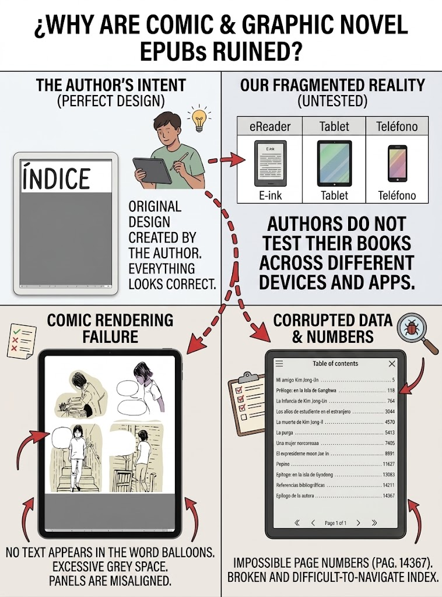

# ePUB Quick Fixes for Fixed-Layout EPUBs

To all the illustrators, graphic novelists, and creators who have embraced the ePUB format for your beautiful stories ... but have never actually checked whether your work displays correctly on an e-reader:

> **Thanks!** **This repository contains my quick shortcuts to keep enjoying your stories!**

---

## The Problem

Fixed-layout EPUBs are a wonderful format for graphic novels and comics. They preserve the layout, the colours, and the pacing of the printed page. They allow for zoom, for interactivity, for layers of text and image.  

But not all e-readers handle them gracefully.  




Some devices clip the edges. Some ignore the text layers. Some scale the content to fit the screen, only to leave it unreadably small. Some apps, even those professional ones, simply refuse to render the text at all.

Not made by criticism, it is a reality of the fragmented e-book ecosystem. And it is the reason this repository exists.

---

## What This Repository Does

This is a collection of tools, scripts, and stylesheets to rescue fixed-layout EPUBs that fail to render correctly on e-readers.

I have tested these methods on:

- Kobo Clara Colour
- Various Android e-Reader apps
- Standard PDF readers

The approach is pragmatic, not elegant. It is a workaround, not a solution. But it works.

> [!IMPORTANT]
> This repository includes a copy of KOReader, KFmon, and several deep-mods, specifically useful for Kobo Clara Colour (and derivatives).

---

## The Tools

### 1. PrincePDF (`02-princepdf/`)

A professional PDF engine with excellent CSS support for Calibre app (includes .deb app for engine and calibre .zip plugin). Works for most EPUBs.

**Use it when:**
-   The EPUB uses standard CSS positioning
-   Text and images are properly layered
-   The content fits within the target page size

**Limitation:**
- Struggles with complex text layering
- Free version adds a watermark

> [!IMPORTANT]
> If using PrincePDF cannot resolve a specidic EPUB, try the following `xhtml-pdf` approach.

---

### 2. XHTML → PDF Workflow (`03-xhtml-pdf/`)

A fallback method when PrincePDF fails. This method renders the pages exactly as a web browser would, preserving all layers, all positions, all text. It sacrifices efficiency for accuracy.

**How it works:**
-   Extracts the EPUB to reveal the individual page files
-   Renders each page as a high-fidelity PDF
-   Preserves all text, images, and layers exactly as they appear in a browser
-   Outputs each page as a separate PDF file

**Use it when:**
-   Text disappears in PrincePDF
-   The layout breaks into fragments
-   You need pixel-perfect fidelity


## The Stylesheets

Many CSS fixes  are provided to handle different page sizes and common issues:
```tree
./03-xhtml-pdf/css-fixes$ tree
├── A2-force-dimensions.css
├── A2-force-margins.css
├── A2-landscape-no-optimisation.css
├── A2-portrait-no-optimisation copy.css
├── A3-force-dimensions.css
├── A3-force-margins.css
├── A3-landscape-no-optimisation.css
├── A3-portrait-no-optimisation.css
├── A4-force-dimensions.css
├── A4-force-margins.css
├── A4-landscape-no-optimisation copy.css
└── A4-portrait-no-optimisation.css
```
> [!IMPORTANT]
Oversized layouts (A3/A2) and "no optimisation" profiles are often better choices to faithfully preserve each page. However, I repeat: **only the correct DPI resolution for each book will prevent text issues.**

- Allows for clean cropping after conversion

---

## How to Use

### Option 1: PrincePDF Plugin

> [!IMPORTANT]
> See [02-princepdf/README.md](02-princepdf/README.md)

1. Install the PrincePDF engine 
2. Install the Calibre plugin
3. Select your EPUB and choose the appropriate stylesheet
4. Generate the PDF

**The free version of PrincePDF adds a watermark. Using larger page sizes (A3, A2) ensures it falls outside the content area and can be cropped out.**  


### Option 2: XHTML → PDF Script

> [!IMPORTANT]
> See [03-xhtml-pdf/README.md](03-xhtml-pdf/README.md)

1. Run the script in `03-xhtml-pdf/`
2. Follow the prompts:
   - Enter the path to your EPUB
   - Choose an output folder
   - Set layout, css fix to be applied, final DPI resolution
   - Confirm
3. The script handles extraction, conversion, and cleanup automatically

---

## Post-Processing

Once you have your PDF pages, you may want to:

### Combine them into a single file

Use any PDF merger tool (PDF Arranger, pdfunite, or online services) to combine the individual pages into one complete document.

### Crop pages to remove margins

Use a PDF cropping tool (like PDF Arranger or pdfcrop) to trim the extra white space from oversized pages.

---

## License

This repository contains configuration files and scripts for personal use. Third-party tools are subject to their own licences.
